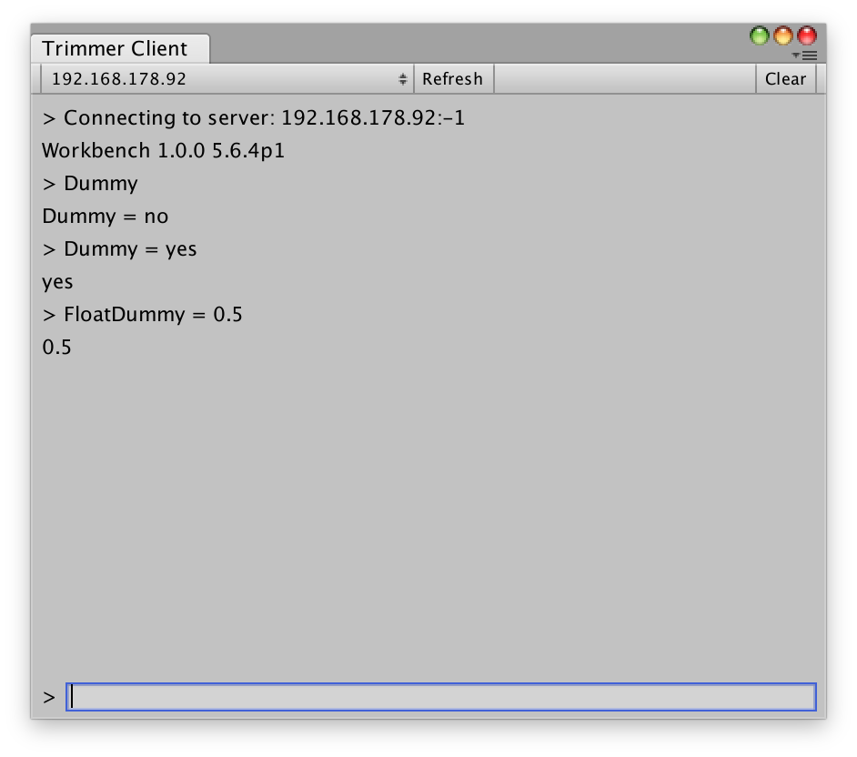

# OptionTrimmerServer

[Source Documentation](xref:sttz.Trimmer.Options.OptionTrimmerServer)

The Trimmer server and client communicate using a simple TCP protocol to allow changing the configuration of a build over the network.

> [!NOTE]
> The trimmer server doesn't use any encryption or authentication. It's intended to use
> during development but unsuitable for inclusion in widely distributed builds.

### In the Editor

Include and enable the *Trimmer Server* Option in a Build Profile. Then open the Client in the Unity Editor from the *Window » Trimmer » Client* menu.

<span class="screenshots">

</span>

If you use the default port and enabled *Discoverable* in the build profile, running servers on the local network should appear automatically in the drop down menu. Otherwise you can add servers manually using a host name or ip address and port. Select a server from the drop down to connect to it and then enter commands in the prompt at the bottom.

Currently only getting and setting Option values is supported. Enter the ini path of an Option (see [OptionIniFile](ini_file.md) for more details) to display its current value or enter *PATH = VALUE* to change the value of an Option.

### Server and Client API

The [TrimmerServer](xref:sttz.Trimmer.Options.TrimmerServer) and [TrimmerClient](xref:sttz.Trimmer.Options.TrimmerServer) classes provide simple interfaces to run the server or to interact with one. Both the server and client support custom commands to extend the protocol.

### Protocol

The Trimmer server uses a simple text-based protocol.

A basic handshake is performed, where the client sends its hello string and optional client details and the server replies with the server hello and optional server details. Both client and server check that the hello matches the expected value.

Then the server waits for messages. The first word in the message is the name of the command and anything after it is passed to the command as argument.

Implemented commands:
* `GET PATH`: Get the value of the Option with the given path
* `SET PATH = VALUE`: Set the value of the Option with the given path
* `PING`: Ping the server, it replies with PONG

The discovery of local servers is done using a UDP broadcast. The client broadcasts the client hello over UDP and the server replies with its hello.

### Connect Manually

It's also possible to interact with a server on the command line using a tool like `socat`.

First send a broadcast to find local servers:

```sh
echo "TRIM" | socat -d -d - UDP-DATAGRAM:255.255.255.255:21076,broadcast
````

Then connect to the server using its IP:

```sh
socat readline TCP:192.168.178.92:21076
```

Once connected, you can enter raw commands in the terminal and see the server's replies.
