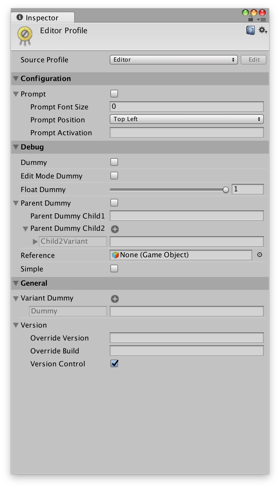
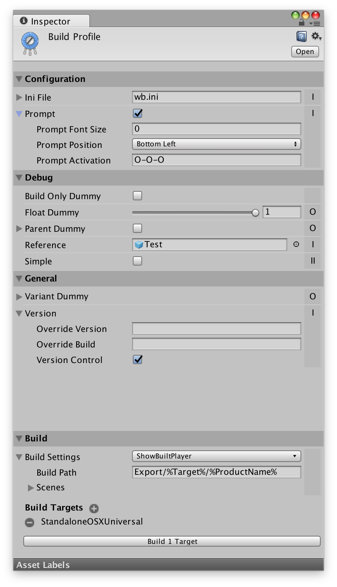

# Using Trimmer
This article gives a quick overview of how to use the Trimmer GUI. For information on how write your own Options, see [Creating Options](creating_options.md). For the documentation of the included Options, see [Bundled Options](bundled_options.md).

## Profiles
The configuration in Trimmer is done using Profiles.

There is a single *[Editor Profile](#editor-profile)* that you can open using *Window » Editor Profile* or by pressing *⌘E* on Mac or *Ctrl-E* on Windows. The Editor Profile is used when playing your project in the editor.

Your project can contain multiple *[Build Profiles](#build-profiles)*. A Build Profile configures a specific build and defines which features to include. You can create a new Build Profile using the *Assets » Create » Build Profile* menu.

There's a single *Active Build Profile*. You can activate a Build Profile by selecting it in the project and then choosing *Activate Profile* from its gear menu in the Inspector. Once a Build Profile has been activated, you can quickly open it using *⌘⌥B* on Mac or *Ctrl-Alt-B* on Windows. The active Build Profile is used for regular Unity builds started from the build window or the build menu commands.

## Options
Options are the basic building blocks of Trimmer, each Option allows you to configure an aspect of your project. Each profile shows you all Options that exist in your project as top-level entries. Options can have variants and children, which can be shown by expanding the option in the profile.

Trimmer detects all Option classes in your project. You don't need to configure anything besides dropping the Option files into your project and Trimmer will automatically detect them. To remove an Option, simply delete its file.

### Options and Features

Trimmer distinguishes between Options and Features. Options are the classes you write to configure an aspect of your project with Trimmer. Features are these aspects and what exactly they are can vary from Option to Option.

Features are an abstract concept used during the build process to allow including/excluding a feature independent of its Option.

Take a SteamOption as an example: Your project contains a Steam API integration and a SteamOption that allows to enable or disable the Steam integration. There are three different types of builds you might want to make:
* *Option and Feature:*
  This build includes both the Steam integration as well as the Option to enable/disable it. This is great for debug builds, where you could include multiple integrations and enable the one you need.
* *Feature only*:
  This build only includes the Steam integration. The Steam integration is built-in, the Option to configure it has been compiled out and the integration cannot be disabled.
* *Without Feature*:
  This build does not include the Steam integration. The integration has been compiled out and cannot be enabled. The Option is never included in this case.

Options can define if they themselves can be included in builds and/or if they have a feature that can be included or removed. The Build Profile UI only enables the configurations that an Option supports.

Take a RunInBackgroundOption as another example: The Option configures Unity's `Application.runInBackground` setting to make the game run when it doesn't have focus. This Option doesn't have a feature, since the setting is build into Unity and cannot be removed. You can only include/exclude the Option in the Build Profile, the feature is greyed out.

Or take a ObfuscateOption: The Option processes the build and obfuscates the .Net assemblies. This Option can only be used during the build and cannot be included in the build itself. You can only include/exclude the feature in the Build Profile to enable/disable the obfuscation, including the Option is greyed out.

## Editor Profile
The Editor Profile can be opened using *Window » Editor Profile* or by using the shortcut *⌘E* on Mac or *Ctrl-E* on Windows.

The Editor Profile configures the available Options when you play the project in the editor.

By default, it will not save changes made to Options while playing, meaning it will reset to its state before entering play mode, just like other Unity scripts. You can change this behavior by toggling «Save Play Mode Changes» in the Trigger section in Unity's preferences.

Unlike Build Profiles, the Editor Profile does not include check boxes to set wether to include options in the build. All options are always available in the editor. Options that have neither the [CanPlayInEditor](xref:sttz.Trimmer.OptionCapabilities.CanPlayInEditor) or [ExecuteInEditMode](xref:sttz.Trimmer.OptionCapabilities.ExecuteInEditMode) capability are not displayed in the Editor Profile.

Instead of using the Editor Profile's internal configuration, it's also possible to choose a Build Profile as source for the configuration used in the editor. Use the drop down at the top of the Editor Profile and choose «Editor» for the internal configuration or any other Build Profile in your project to use that profile's configuration. Note that when you've selected another profile, you can no longer edit the Options directly in the Editor Profile and you need to switch to the selected Build Profile to edit them.

Besides testing Build Profiles in the editor, this also allows to create configuration profiles, i.e. Build Profiles that are only used as a configuration preset for use in the editor. You can e.g. set up a debugging profile to quickly enable a set of debugging options in the editor.

## Build Profiles
Build Profiles are assets in your project. You can create new ones using the *Assets » Create » Build Profile* menu.

 

A Build Profile configures a specific build. You can have an arbitrary number of Build Profiles and a Build Profile can be used to build for multiple platforms.

For each top-level Option, the Build Profile contains a toggle in the right-hand column that defines if the Option and/or its associated feature is included in the build.

Legend:
* **O**: Both feature and Option are removed from the build
* **I**: Either feature or Option is included
* **II**: Both feature and Option are included

Note that it depends on the Option's [capabilities](xref:sttz.Trimmer.OptionCapabilities) wether it has a [feature](xref:sttz.Trimmer.OptionCapabilities.HasAssociatedFeature) that can be excluded/included or wether the [Option itself](xref:sttz.Trimmer.OptionCapabilities.CanIncludeOption) can be included in the build. Accordingly, the entries in the drop-down menu will be disabled or the menu completely missing when neither can be included.

Excluded features and Options will be completely removed from the build. If only the Option is removed, the feature will be frozen, so that it can no longer be configured in the build.

Options can specify wether they are available for a given platform. If the Build Profile does not include any platforms supported by an Option, the Option will be hidden. You can toggle showing unavailable Options in the Build Profile's gear menu under «Toggle Show Unavailable». Unavailable options have their include menu disabled and will always be excluded from the build.

If the Build Profile doesn't have any build targets set, the currently active build target will be used.

## Building
There are two main ways to do a build using Trimmer: A  profile build and a regular Unity build.

A profile build is started directly on a Build Profile in its Build section at the bottom. A profile build allows the profile to set the build platforms, options, scenes and output path. This allows to e.g. build a different set of scenes depending on the Build Profile used or to have debug or release builds that use different configurations.

A regular Unity build is started in Unity's build window or using the *Build & Run* menu. A regular Unity build will always only build for the platform selected in the build window and will use the build window's options and scenes. Which profile's configuration will be used depends on which profile is active. You can open the active profile using the *Window » Active Build Profile* menu or by using *⌘⌥B* on Mac or *Ctrl-Alt-B* on Windows. To activate a given profile, select «Activate Profile» from the Build Profile's gear menu.

If you make a regular Unity build without an active profile, all options will use their default value and will be excluded from the build.

### Command Line Builds

Trimmer can also be used to make builds using Unity's command-line batch mode.

The command line to start a build looks like this:

    unity -quit -batchmode -executeMethod sttz.Trimmer.Editor.BuildManager.Build

Replace `unity` with the path to your Unity binary. See [Unity's documentation](https://docs.unity3d.com/Manual/CommandLineArguments.html) for more information.

This will make a build of the active profile. You can also specify a profile by name using `-profileName`:

    unity -quit -batchmode -executeMethod sttz.Trimmer.Editor.BuildManager.Build -profileName "PROFILE_NAME"

Replace `PROFILE_NAME` with the name of the profile (case-insensitive).

Make sure the profile sets an output location for the build. If the profile doesn't set one or you want to override it, you can use `-output`:

    unity -quit -batchmode -executeMethod sttz.Trimmer.Editor.BuildManager.Build -profileName "PROFILE_NAME" -output "PATH"

Replace `PATH` with where you want your build(s) to be saved.

### Unity Cloud Build

Trimmer supports building with Unity Cloud Build.

To specify which profile to use, add the name of the profile to the target name in Unity Cloud Build, enclosed by double underscores.

E.g. the profile named "Example" should be added as "\_\_Example\_\_" to the target's name.

Finally set `sttz.Trimmer.Editor.BuildManager.UnityCloudBuild` as Pre-Export Method in the target's Advanced Options.

Note that Unity Cloud Build doesn't support custom BuildOptions, flags set by Options will be ignored. However, setting scenes is supported and the scenes set in your profile will be used over the ones set in Build Settings.
